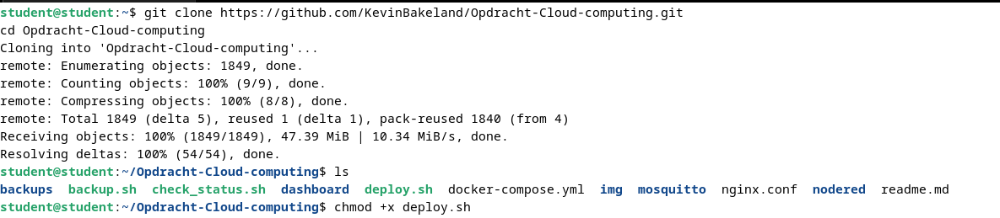
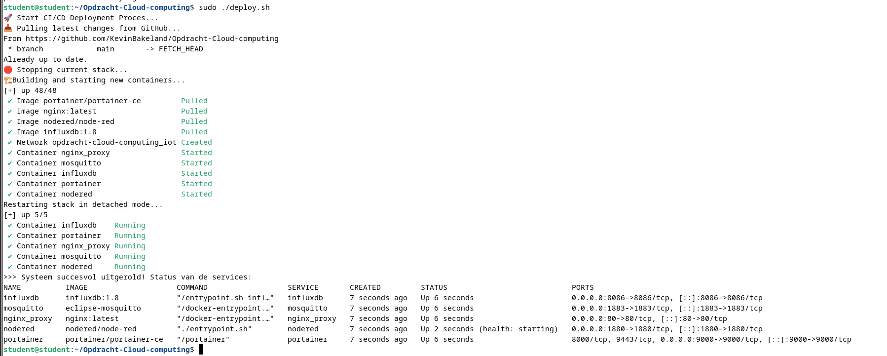
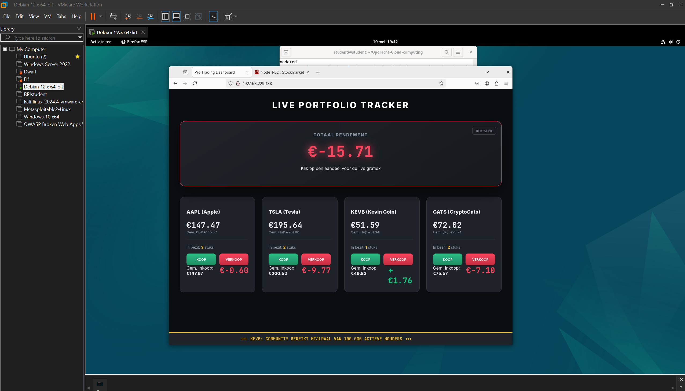

# Portability Test

Ik heb dit project gekloond naar een andere VM, de Docker stack gestart met `./deploy.sh` en alle services gecontroleerd.

Alles werkte perfect: het dashboard laadde goed, Node-RED was bereikbaar, en de containeromgeving draaide stabiel zonder fouten.

