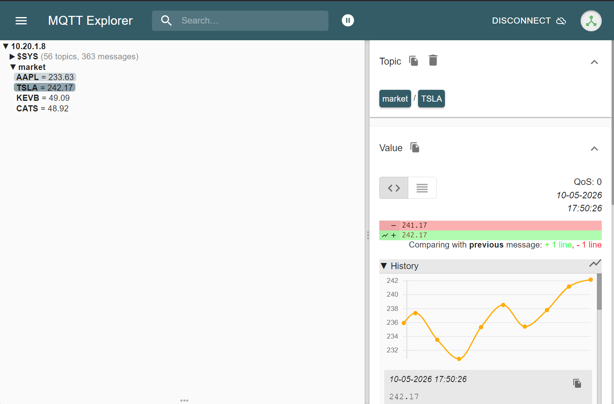

# Smart Gateway Dashboard

## Overzicht
Dit project is een slimme gateway voor een live trading dashboard. Het gebruikt Node-RED om fictieve stock- en crypto-prijsdata te genereren, InfluxDB om de tijdreeksdata op te slaan, en een Nginx-hosted frontend om live portfoliostatus, winst/verlies en grafieken te tonen.


## Wat doet het project?
- Node-RED genereert en verwerkt realtime stockdata voor vier stocks: `AAPL`, `TSLA`, `KEVB` en `CATS`.
- De gegenereerde data wordt opgeslagen in InfluxDB onder de database `sensors`.
- Het dashboard haalt live prijzen op, toont het gemiddelde van de laatste 1 uur, en biedt een interactieve grafiek per aandeel.
- Gebruikers kunnen kopen en verkopen, waarna portfoliowaardes worden bijgewerkt in Node-RED en lokaal getoond in de frontend.

## Architectuur
Het project draait als Docker stack met de volgende services:
- `mosquitto` - MQTT broker voor Node-RED communicatie.
- `nodered` - Node-RED runtime voor data-generatie, logica en opslag.
- `influxdb` - Tijdreeksdatabase voor prijsdata.
- `dashboard` - Nginx-served statische website op basis van `dashboard/public`.
- `portainer` - Beheerinterface voor containers.

## Belangrijke mappen
- `/root/smart-gateway/nodered` - Node-RED data en flows.
- `/root/smart-gateway/influxdb` - InfluxDB data opslag.
- `/root/smart-gateway/dashboard/public` - Frontend code (`index.html`, `js/script.js`, `js/news.js`, `css/style.css`).
- `/root/smart-gateway/mosquitto/config` - Mosquitto configuratie.

## Hoe werkt Node-RED hier?
Node-RED is mijn centrale verwerkingslaag in dit project en bevat drie hoofdblokken:
- een market simulator die prijzen genereert,
- een verwerkingsstroom die de data valideert en omzet naar InfluxDB,
- en een portfolio-sync via HTTP endpoints.

## ⚙️ Diepgaande Node-RED Logica
In dit project is Node-RED de centrale verwerkingseenheid. De flow is opgebouwd uit drie cruciale logische lagen in **Function Nodes**.

### 1. Prijssimulatie (Random Walk)
De gateway genereert zijn eigen marktbewegingen. Elke 10 seconden wordt de prijs van de vier aandelen bijgewerkt met een willekeurige factor tussen -2% en +2%. Dit zorgt voor een realistische, bewegende grafiek in het dashboard.
* **Techniek**: Gebruik van `Math.random()` gecombineerd met `flow.set/get` om de vorige prijs te onthouden.
* **Startwaarden**:
  - `AAPL`: `150.00`
  - `TSLA`: `200.00`
  - `KEVB`: `50.00`
  - `CATS`: `75.00`
* **Output**: vier MQTT-berichten naar topics zoals `market/AAPL`, `market/TSLA`, `market/KEVB` en `market/CATS`.



### 2. Dynamische Dataverwerking & Portfolio Logica
In plaats van statische berekeningen, hanteert de gateway een dynamisch systeem waarbij de portfolio-status realtime wordt bijgewerkt op basis van gebruikersinteractie.

* **Input**: De gateway ontvangt live koersen via `market/#` en koop/verkoop signalen via HTTP/MQTT.
* **State Management (Global Context)**: 
    - De gateway houdt per aandeel de **gemiddelde inkoopprijs** (`buyPrice`) en het **aantal aandelen** in bezit bij. 
    - Bij een nieuwe "Koop" transactie wordt de inkoopprijs dynamisch herberekend.
* **Validatie**: 
    - Controleert op geldige getallen en positieve prijzen.
    - Voorkomt "short selling" (je kunt niet meer verkopen dan je in bezit hebt).
* **Live Rendementsberekening**:
    Het dashboard toont niet alleen de prijs, maar berekent continu de ongerealiseerde winst/verlies op de huidige positie:

* **Output**: Een verrijkt JSON-object naar het dashboard en opslag in InfluxDB (`measurement: "portfolio_stats"`) om de groei van het vermogen over tijd te monitoren.

### 3. Portfolio Cloud Sync & Global State
De frontend synchroniseert portfolio-data met Node-RED via HTTP endpoints.
* **Endpoint** `/get-portfolio`: haalt de huidige portfolio op uit `global.get('portfolio')` en retourneert die als response.
* **Endpoint** `/update-portfolio`: ontvangt een payload met `stock`, `amount` en `totalCost`, werkt het portfolio object bij en slaat het op met `global.set('portfolio', portfolio)`.
* **Voordeel**: je portfolio blijft bewaard in Node-RED, ook als de browser wordt ververst of de frontend opnieuw wordt geladen.

### 4. Flow-structuur in Node-RED
De flow is opgebouwd als:
- `Market Simulator (Sensoren)`:
  - Inject node `Elke 10 seconden`
  - Function node `Stock Price Generator`
  - MQTT node `Mosquitto Broker`
- `Data Verwerking & Validatie`:
  - MQTT subscribe node `Subscribe Market`
  - Function node `Validatie & P/L Berekening`
  - InfluxDB output node `Sensors DB`
- `Portfolio Cloud Sync`:
  - HTTP input node `[get] /get-portfolio`
  - Function node `Get Global Stats`
  - HTTP response node
  - HTTP input node `[get] /update-portfolio`
  - Function node `Save to Global`
  - HTTP response node


---

## Installatie en deployment
Voer dit uit vanuit de map `/root/smart-gateway`:

```bash
cd /root/smart-gateway
chmod +x deploy.sh
./deploy.sh
```

Het script stopt oude containers, haalt images op, bouwt waar nodig en start de stack opnieuw.

## Toegankelijke diensten
- Dashboard: `http://10.20.1.8/`
- Node-RED: `http://10.20.1.8:1880/`
- Portainer: `http://10.20.1.8:9000/#!/auth`

## Controle en monitoring
- `check_status.sh` controleert of de containers draaien.
- Het script kan handmatig worden gestart met:

```bash
chmod +x /root/smart-gateway/check_status.sh
./check_status.sh
```

- Er is ook een cronjob die dit elk uur uitvoert.
- Kijk in `/root/logs.txt` voor tijdstippen en eventuele uitvalmeldingen.

## Gebruik van het dashboard
- Open het dashboard via `http://10.20.1.8/`.
- Klik op een kaart om een live grafiek van het aandeel te openen.
- Gebruik de knoppen `Koop` en `Verkoop` om transacties te simuleren.
- De sectie `Totaal Rendement` toont je huidige winst/verlies inclusief vaste winst uit verkochte posities.
- Gebruik `Reset Sessie` om alle posities en sessiewinst terug te zetten naar nul.


## Aanvullende info
- De frontend haalt live data uit InfluxDB en gebruikt Chart.js voor grafieken.
- Node-RED gebruikt de dependencies `node-red-contrib-influxdb` .

---

