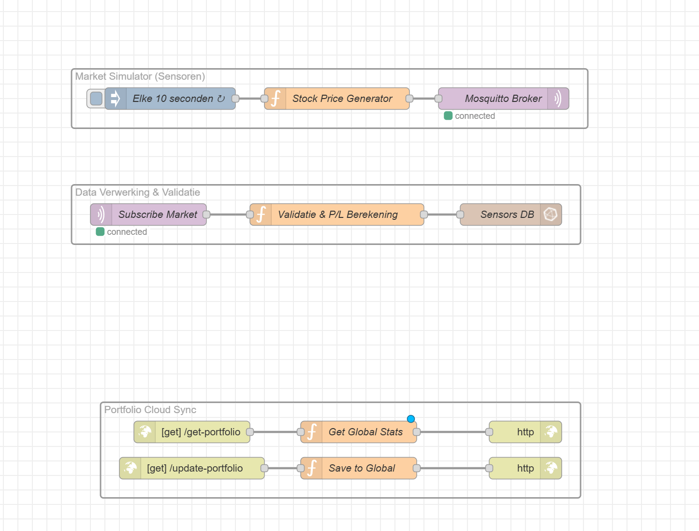
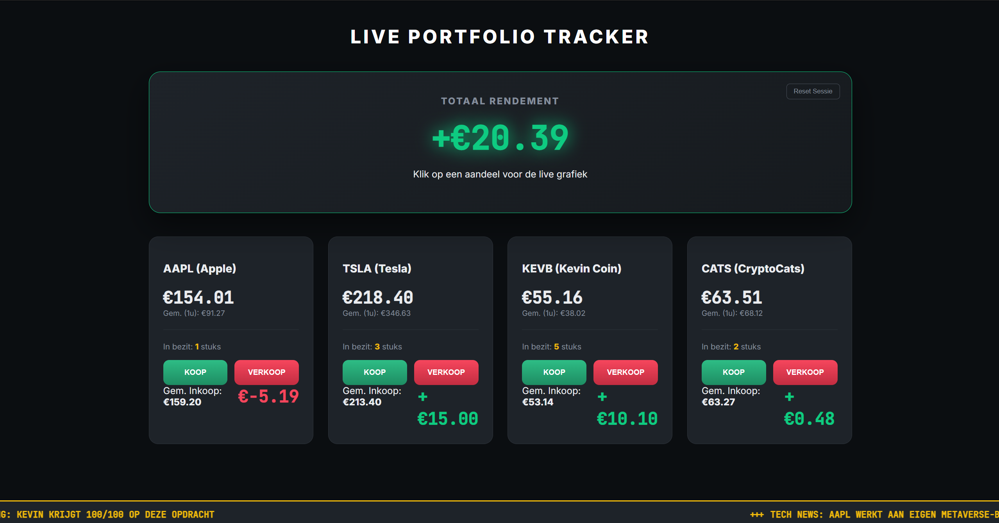

# Smart Gateway Dashboard

## Wat er nog moet veranderd worden

- Zorg ervoor dat heel het project gestard kan worden met alleen docker compose up.
- Zorg ervoor dat je geen account moet aanmaken voor die verschilende websites zoals portainer en uptime-kuma
- Verander het docker netwerk van IoT naar Switch

## Overzicht
Dit project is een slimme gateway voor een live trading dashboard.
Het gebruikt een Python-script dat in een Docker-container draait om fictieve crypto-data te genereren en deze via Mosquitto op een MQTT-server te publiceren.
Node-RED haalt vervolgens de data op via MQTT en slaat deze op in een InfluxDB-database.
Node-RED wordt ook gebruikt om de data uit InfluxDB op te halen en deze weer te geven op het dashboard.


## Wat doet het project?
- De Python script genereert en verwerkt realtime stockdata voor vier stocks: `AAPL`, `TSLA`, `KEVB` en `CATS`.
- De gegenereerde data wordt opgeslagen in InfluxDB onder de database `sensors`.
- Het dashboard haalt live prijzen op, toont de prijs van de stock, en biedt een interactieve grafiek per aandeel.
- Gebruikers kunnen kopen en verkopen in ene leuk spel om proberen geld te verdienen

## Architectuur
Het project draait als Docker stack met de volgende services:
- `mosquitto` - MQTT broker voor Node-RED communicatie.
- `nodered` - Node-RED runtime om data te plaatsen op influxDB en data te tonen op de database.
- `influxdb` - Tijdreeksdatabase voor prijsdata.
- `dashboard` - Nginx-served statische website op basis van `dashboard/public`.
- `portainer` - Beheerinterface voor containers.
- `Uptime-Kuma` - Voor emails te krijgen mocht een docker uitvallen

## Belangrijke mappen
- `/root/smart-gateway/nodered` - Node-RED data en flows.
- `/root/smart-gateway/influxdb` - InfluxDB data opslag.
- `/root/smart-gateway/dashboard/public` - Frontend code (`index.html`, `js/script.js`, `js/news.js`, `css/style.css`).
- `/root/smart-gateway/mosquitto/config` - Mosquitto configuratie.

## Hoe werkt Node-RED hier?
Node-RED is mijn centrale verwerkingslaag in dit project en bevat drie hoofdblokken:
- een market simulator die prijzen genereert,
- een verwerkingsstroom die de data valideert en omzet naar InfluxDB,
- en een portfolio-sync via HTTP endpoints.
 

## Installatie en deployment
Voer dit uit in de map:

```bash
cd Opdracht-Cloud-computing
chmod +x deploy.sh
./deploy.sh
```

Het `deploy.sh`-script automatiseert het deploymentproces. Het haalt de nieuwste versie van het project op via GitHub, stopt en herstart de Docker-containers en zorgt dat de nodige mappen en rechten correct zijn ingesteld.
Daarnaast controleert het script of InfluxDB actief is, maakt automatisch de `portfolio`-database aan en installeert de benodigde Node-RED library.
Na de deployment worden de links naar de verschillende services weergegeven.

## Gebruik van het dashboard
- Klik op een kaart om een live grafiek van het aandeel te openen.
- Gebruik de knoppen `Koop` en `Verkoop` om transacties te simuleren.
- De sectie `Totaal Rendement` toont je huidige winst/verlies inclusief vaste winst uit verkochte posities.
- Gebruik `Reset Sessie` om alle posities en sessiewinst terug te zetten naar nul.



## Aanvullende info
- De frontend haalt live data uit InfluxDB en gebruikt Chart.js voor grafieken.

## 🎁 Bonus: 
Uptime-Kuma zorgt ervoor dat je een email(kan ook andere dingen instellen) krijgt mocht een docker stoppen zodat je het probleem zo snel mogelijk zou kunnen oplossen

